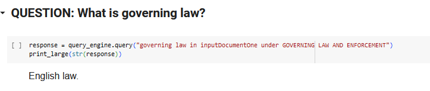

# Building-RAG_application_using_LLama_Index_and_OpenAI
This project demonstrate how to use llama index with openAI to create RAG application

## Directory Structure
- [propensity_modelling.ipynb](./propensity_modelling.ipynb): Notebook contains the code for utilizing LlamaIndex with openAI to create RAG application. It covers embedding technique, IndexTypes(VectorStoreIndex, CompositeIndex and Keyword Index) and How t query open AI using LLamaIndex Query Engine

# Question 1

# Question 2

# Question 3

